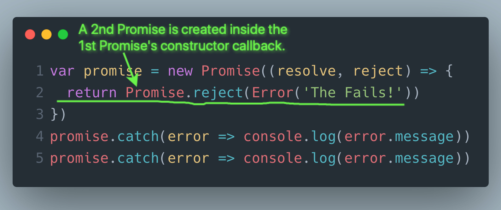
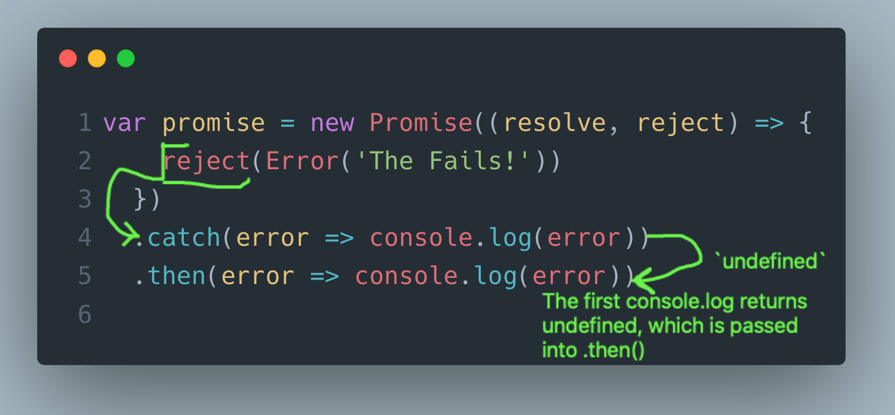

# Test your Knowledge of JavaScript Promises

> * **Prove your JavaScript skillz!** 🚀
> * No login or signup required. ✨
> * Multiple choice. 🤖 ... _How difficult can it be, eh?_

<!--  -->
<!-- QUIZ HTML HERE WILL BE AUTO-EXTRACTED BY
`AutoLoader` COMPONENT HELPER CLASS  -->


<div style="text-align: center; width: 75%; margin: 0 auto 10rem auto; white-space: nowrap; font-size: 1.4em;" class="quiz-loading">

  <svg class="loading-spinner" xmlns="http://www.w3.org/2000/svg" width="50" height="50" viewBox="0 0 24 24">
    <path d="M17.65 6.35C16.2 4.9 14.21 4 12 4c-4.42 0-7.99 3.58-7.99 8s3.57 8 7.99 8c3.73 0 6.84-2.55 7.73-6h-2.08c-.82 2.33-3.04 4-5.65 4-3.31 0-6-2.69-6-6s2.69-6 6-6c1.66 0 3.14.69 4.22 1.78L13 11h7V4l-2.35 2.35z">
    <path d="M0 0h24v24H0z" fill="none">
  </svg>
  <h4 style="text-align: left">Loading...<br />A few more seconds...</h4>

</div>

<div style="text-align: center; display: none;" class="quiz-ready">

## 👇 Complete 9 Questions Below👇

</div>

<!-- #1 -->
<section class="challenge" group="Handling Errors">
  <div class="description">

# Multiple `.catch`'s

```js
var p = new Promise((resolve, reject) => {
  reject(Error('The Fails!'))
})
p.catch(error => console.log(error.message))
p.catch(error => console.log(error.message))
```

## What will the output be?

  </div>
  <ul class="options">
    <li>print message once</li>
    <li class="answer">print message twice</li>
    <li>UnhandledPromiseRejectionWarning</li>
    <li>process exits</li>
  </ul>
  <div class="explanation">

We create a Promise using the constructor method, triggering an error immediately with the `reject` callback.

Then the `.catch` handlers work like the DOM's `.addEventListener(event, callback)` or Event Emitter's `.on(event, callback)` where **multiple handler callbacks can be added.** Each will be called with the same arguments.

  </div>
</section>


<!-- #2 -->
<section class="challenge" group="Handling Errors">
  <div class="description">

# Multiple `.catch`'s

```js
var p = new Promise((resolve, reject) => {
  return Promise.reject(Error('The Fails!'))
})
p.catch(error => console.log(error.message))
p.catch(error => console.log(error.message))
```

## What will the output be?

  </div>
  <ul class="options">
    <li>print message once</li>
    <li>print message twice</li>
    <li class="answer">UnhandledPromiseRejectionWarning</li>
    <li>process exits</li>
  </ul>
  <div class="explanation">



When using the Promise constructor you must invoke either `resolve()` or `reject()` callbacks. The Promise constructor doesn't use your return value, so the additional Promise created with `Promise.reject()` will effectively never be heard from again. 

With no `.catch` following the `Promise.reject()`, the answer is `UnhandledPromiseRejectionWarning`.

  </div>
</section>

<!-- #3 -->
<section class="challenge" group="Handling Errors">
  <div class="description">

# Chaining `.then` and `.catch`'s

```js
var p = new Promise((resolve, reject) => {
    reject(Error('The Fails!'))
  })
  .catch(error => console.log(error))
  .then(error => console.log(error))
```

## What will the output be?

  </div>
  <ul class="options">
    <li class="answer">print error and `undefined`</li>
    <li>print error twice</li>
    <li>UnhandledPromiseRejectionWarning</li>
    <li>undefined</li>
  </ul>
  <div class="explanation">



When chaining `.then`'s and `.catch`'s it is helpful to think of them as a series of steps. Each `.then` receives the value returned by the previous `.then` (as its argument.) However, if your "step" encountered an error, any subsequent `.then` "steps" will be skipped until a `.catch` is encountered. If you want to override an error, all you need to do is return a non-error value. It can be accessed via any subsequent `.then`.

**Hint:** `console.log()` always return `undefined`.

  </div>
</section>

<!-- #4 -->
<section class="challenge" group="Handling Errors">
  <div class="description">

# Chaining `.catch`'s

```js
var p = new Promise((resolve, reject) => {
    reject(Error('The Fails!'))
  })
  .catch(error => console.log(error.message))
  .catch(error => console.log(error.message))
```

## What will the output be?

  </div>
  <ul class="options">
    <li class="answer">print error message once</li>
    <li>print error message twice</li>
    <li>UnhandledPromiseRejectionWarning</li>
    <li>process exits</li>
  </ul>
  <div class="explanation">

When chaining `.catch`'s, each one only handles errors thrown in previous `.then` or `.catch` "steps". In this example the first `.catch` returns the `console.log` which could only be accessed via adding a `.then()` after both the `.catch`'s.

  </div>
</section>


<!-- #5 -->
<section class="challenge" group="Handling Errors">
  <div class="description">

# Multiple `.catch`'s

```js
new Promise((resolve, reject) => {
    resolve('Success!')
  })
  .then(() => {
    throw Error('Oh noes!')
  })
  .catch(error => {
    return "actually, that worked"
  })
  .catch(error => console.log(error.message))
```

## What will the output be?

  </div>
  <ul class="options">
    <li>print message once</li>
    <li>print message twice</li> 
    <li>UnhandledPromiseRejectionWarning</li>
    <li class="answer">nothing prints</li>
  </ul>
  <div class="explanation">

**Hint:** `.catch`'s can be used to ignore (or override) errors simply by returning a regular value.

This trick works only when there is a subsequent `.then` to receive the value.

  </div>
</section>


<!-- #6 -->
<section class="challenge" group="Handling Errors">
  <div class="description">

# Flow between `.then`'s

```js
Promise.resolve('Success!')
  .then(data => {
    return data.toUpperCase()
  })
  .then(data => {
    console.log(data)
  })
```

## What will the output be?

  </div>
  <ul class="options">
    <li>print "Success!" and "SUCCESS!"</li>
    <li>print "Success!"</li>
    <li class="answer">print "SUCCESS!"</li>
    <li>nothing prints</li>
  </ul>
  <div class="explanation">

**Hint:** `.then`'s pass data sequentially, from `return value` to the next `.then(value => /* handle value */)`.

A `return` is key in order to pass a value to the next `.then`.


  </div>
</section>


<!-- #7 -->
<section class="challenge" group="Handling Data">
  <div class="description">

# Flow between `.then`'s

```js
Promise.resolve('Success!')
  .then(data => {
    return data.toUpperCase()
  })
  .then(data => {
    console.log(data)
    return data
  })
  .then(console.log)
```

## What will the output be?

  </div>
  <ul class="options">
    <li>print "SUCCESS!"</li>
    <li>print "Success!"</li>
    <li class="answer">print "SUCCESS!" and "SUCCESS!"</li>
    <li>nothing prints</li>
  </ul>
  <div class="explanation">

There are 2 `console.log` calls which will be called.

  </div>
</section>


<!-- #8 -->
<section class="challenge" group="Handling Data">
  <div class="description">

# Flow between `.then`'s

```js
Promise.resolve('Success!')
  .then(data => {
    data.toUpperCase()
  })
  .then(data => {
    console.log(data)
  })
```

## What will the output be?

  </div>
  <ul class="options">
    <li>print "SUCCESS!"</li>
    <li>print "Success!"</li>
    <li>print "SUCCESS!" and "SUCCESS!"</li>
    <li class="answer">prints `undefined`</li>
  </ul>
  <div class="explanation">

**Hint:** `.then`'s pass data sequentially, from `return value` to the next `.then(value => /* handle value */)`.

A `return` is key in order to pass a value to the next `.then`.

  </div>
</section>


<!-- #9 -->
<section class="challenge" group="Handling Data">
  <div class="description">

# Flow between `.then`'s and `.catch`'s

```js
Promise.resolve('Success!')
  .then(() => {
    throw Error('Oh noes!')
  })
  .catch(error => {
    return 'actually, that worked'
  })
  .then(data => {
    throw Error('The fails!')
  })
  .catch(error => console.log(error.message))
```

## What will the output be?

  </div>
  <ul class="options">
    <li>print "Oh noes!" and "The fails!"</li>
    <li>print "Oh noes!"</li>
    <li class="answer">print "The fails!"</li>
    <li>print "actually, that worked"</li>
    <li>nothing prints</li>
  </ul>
  <div class="explanation">


  </div>
</section>


